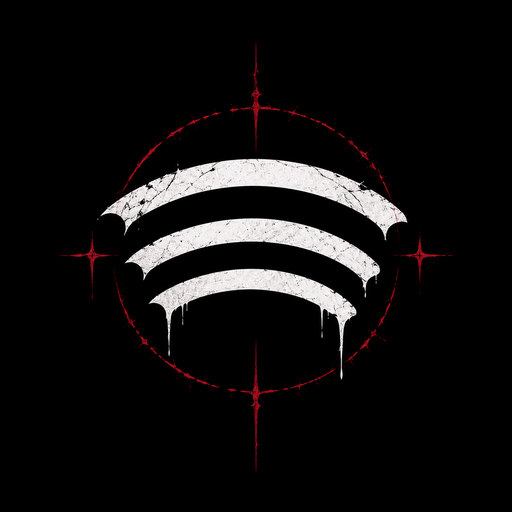

<div align="center">

<p align="center">
  
</p>

<p align="center">
  <picture>
    <source media="(prefers-color-scheme: dark)" srcset="assets/logo_dark.svg">
    <source media="(prefers-color-scheme: light)" srcset="assets/logo_light.svg">
    
  </picture>
</p>

<p align="center">
  <b>All-in-one Android music client powered by Spotify / Yandex Music catalogs and an intelligent parallel audio fallback engine.</b>
</p>

<p align="center">
  <a href="README.md"><b>🇷🇺 Русский</b></a> • <a href="README_EN.md"><b>🇬🇧 English</b></a>
</p>

<p align="center">
  
  
  
  <a href="https://github.com/DrxwnSlvt/Drownify/releases/latest">
    
  </a>
</p>

</div>

---

## ⚡ What is Drxwnify?

**Drxwnify** is an uncompromising music player for Android that fuses your streaming catalogs with a resilient, multi-source audio resolution and export engine.

The app decouples music into two independent layers:
1. **Metadata & Library Catalog (Spotify or Yandex Music)** — powers your liked songs, albums, artists, smart taste-profile recommendations, and catalog search without requiring a Spotify Premium subscription.
2. **Parallel Audio Fallback Engine** — locates the highest quality stream across independent networks (SoundCloud, YouTube, VK Music, Qobuz Hi-Res, Bandcamp, Audius, Soulseek) using strict metadata matching.

---

## 🎧 Core Features

### 🔄 Catalog Layer & Two-Way Synchronization
* **Spotify by default**: built-in secure WebView authentication — zero developer dashboard setup, no Client ID, no manual token management.
* **Yandex Music**: native login and deep catalog integration. When connected, Yandex Music can be selected as your primary metadata and search provider.
* **Personalized Recommendations**: dynamic home screen populated with your top tracks, favorite artists, new releases, and curated playlists.
* **Smart Queue**: custom recommendation algorithm generates continuous radio queues based on your taste profile, genre affinity, and listening history.
* **Two-Way / Reverse Synchronization**:
  * Liking a track in the player, lock screen, or home screen widget $\rightarrow$ instantly adds it to your Spotify Liked Songs or Yandex Music favorites.
  * Saving an album $\rightarrow$ adds the album to your streaming account library.
  * Following an artist $\rightarrow$ immediately follows them on your connected account.
  * Unliking and unfollowing syncs back automatically.

---

### 🔀 Parallel Audio Fallback Engine

Drxwnify **never streams audio directly from Spotify** (Spotify is strictly utilized as a metadata and discovery catalog). This eliminates the requirement for Spotify Premium and removes any risk of account restrictions.

When a track is played or queued for download, Drxwnify takes authoritative metadata (title, artists, album, duration, and the universal **ISRC** identifier) and initiates a parallel race across enabled audio providers:

```
┌────────────────────────────────────────────────────────────────────────┐
│               Data Catalog (Spotify / Yandex Music)                    │
│              [ Metadata, ISRC, Cover Art, Duration ]                   │
└───────────────────────────────────┬────────────────────────────────────┘
                                    │
                       Parallel Provider Race
                                    ▼
       ┌─────────────┬─────────────┬─────────────┬─────────────┐
       │ SoundCloud  │ YouTube     │ VK Music    │ Bandcamp    │
       ├─────────────┼─────────────┼─────────────┼─────────────┤
       │ Audius      │ Qobuz FLAC  │ Soulseek    │ Local DB    │
       └─────────────┴─────────────┴─────────────┴─────────────┘
                                    │
                                    ▼
       ┌─────────────────────────────────────────────────────────┐
       │     Fastest Winner Selection + Seamless Silent Fallback │
       └─────────────────────────────────────────────────────────┘
```

#### Supported Audio Sources:
1. **SoundCloud** — rapid response, originals, remixes, live sets, and underground releases.
2. **YouTube & YouTube Music** — massive library of official tracks, rare songs, acoustic sessions, and live performances.
3. **VK Music** — native VK login, giving access to an enormous catalog of music.
4. **Bandcamp** — independent artist catalog, high audio fidelity, and original creator uploads.
5. **Audius** — decentralized Web3 music streaming platform.
6. **Qobuz Lossless** — true audiophile fidelity (FLAC up to 24-bit / 192 kHz) with automatic failover rotation between independent community resolvers (*Monokenny*, *Jumo*, *Squid*, *Trypt*).
7. **Soulseek** — legendary P2P network as a last-resort fallback for rare, out-of-print, and obscure recordings (with credential storage and "Wi-Fi Only" guard).

#### Fallback Mechanism Highlights:
* **Silent Fallback**: if a higher-priority provider is rate-limited, region-locked, or lacks the track, playback instantly fails over to the next enabled provider without interruption or errors.
* **Custom Priority Order**: fully rearrange provider ranking or toggle specific providers on/off in *Settings → Music sources*.
* **Persistent SQLite Caching**: resolved matches are stored locally. Subsequent plays and offline downloads resolve in milliseconds without repeating searches.
* **Manual Override**: if a song matches an unexpected YouTube version, paste the preferred YouTube link via the player's three-dot menu («Change YouTube version») to permanently lock that version.
* **Audio Diagnostics**: an in-app real-time log displays every resolution step, match confidence scores, and the winning provider.

---

### 💾 Downloads & Device Storage Export

* **Custom Storage Directory**: pick any directory on internal storage or MicroSD card using the native Android SAF picker (*Settings → Storage → Download folder*).
* **One-Tap Liked Songs Batch Download**: export your entire Liked Songs library with a single tap.
* **Batch Album & Playlist Downloads**: playlists land organized in a dedicated folder named after the playlist, while albums follow the standard `Artist / Album / 01. Track.mp3` directory structure.
* **Standalone Tagged .MP3 Files**: built-in FFmpegKit transcodes downloads into universal standalone `.mp3` files with full ID3 metadata tags (title, artist, album, year) and high-resolution embedded album art. Fully readable by Telegram, car head units, and third-party media players.
* **Multi-Stage Progress Tracking**: clear real-time status for batches: `Searching` $\rightarrow$ `Downloading` $\rightarrow$ `Formatting` $\rightarrow$ `Done`. Background downloads persist across app restarts and automatically recover incomplete exports.

---

### 👥 Listen Together
* Synchronized real-time listening rooms with friends via low-latency WebSockets (Metroserver protocol).
* Real-time sync for current song, playback position, play/pause state, queue changes, and host volume.
* Debounced latency compensation eliminates playback stuttering and micro-skips.
* In-app synchronization activity log visible in room settings.

---

### 🎛️ Audio Engine & Feature Suite

| Category | Highlights |
| :--- | :--- |
| **Acoustic Engine** | Built-in Parametric EQ with custom biquad filters and profile presets, volume normalization (ReplayGain), customizable crossfade, gapless playback, silence skipping, and tempo/pitch adjustment (Varispeed). |
| **Lyrics & AI** | Time-synced line-by-line and word-by-word karaoke lyrics (*Better Lyrics*, *KuGou*, *LrcLib*, *LyricsPlus*). **AI Lyrics Translation & Meaning Analysis** (powered by Mistral, DeepL, OpenRouter). Automatic romanization of Asian scripts (Pinyin, Romaji, Hangul). |
| **Convenience** | **SponsorBlock** (auto-skips sponsorships, non-music filler, intros, and outros in YouTube audio). Auto-download upon liking a song. |
| **Timer & Alarm** | Advanced sleep timer with gradual audio fade-out and "finish current track" toggle. Built-in musical alarm scheduler. |
| **Integrations** | **Discord Rich Presence** (displays current track, album art, and progress in Discord), full **Android Auto** compatibility, and customizable desktop widget with controls and live like sync. |
| **Interface** | Material 3 interface, dynamic Monet palette extraction from system wallpaper, themes (Light, Dark, Pure Black OLED). Animated launch intro featuring the signature **Metal Mania** typography. |

---

## 📥 Download & Installation

1. Visit the [**Drxwnify Releases**](https://github.com/DrxwnSlvt/Drownify/releases/latest) page.
2. Download the latest **Drxwnify.apk** asset.
3. Open the APK on your Android device to install (allow "Install unknown apps" if prompted).

> [!IMPORTANT]
> **To ensure uninterrupted background playback:**
> Disable Android battery optimizations for Drxwnify:
> **Phone Settings → Apps → Drxwnify → Battery → Unrestricted**.
> This prevents Android from killing background network streaming while the screen is locked.

---

## ❓ Frequently Asked Questions (FAQ)

<details>
<summary><b>Do I need a Spotify Premium subscription?</b></summary>
<br>
<b>No.</b> Drxwnify only accesses Spotify's catalog APIs for metadata, playlists, and taste recommendations. All audio playback is fulfilled through independent audio sources (SoundCloud, YouTube, VK, Qobuz, etc.). A free Spotify account works completely.
</details>

<details>
<summary><b>Why do tracks take an extra second to start on the first play?</b></summary>
<br>
On the very first play of an unresolved track, the parallel resolver queries configured audio networks to identify the most accurate match. Once resolved, the match is permanently cached in local SQLite, making subsequent plays and downloads virtually instantaneous.
</details>

<details>
<summary><b>How do I customize the download folder?</b></summary>
<br>
Navigate to <b>Settings → Storage → Download folder</b> and select your preferred folder via the system file picker. Downloaded songs are transcoded into clean <code>.mp3</code> files with embedded metadata and album covers.
</details>

<details>
<summary><b>Can my streaming account get banned?</b></summary>
<br>
The risk is minimal. Drxwnify interacts with Spotify and Yandex Music via standard user endpoints without artificial play counts or illicit audio stream extraction. Likes and library sync operations replicate the official web player.
</details>

<details>
<summary><b>What should I do if a song matched the wrong version?</b></summary>
<br>
In the Now Playing player screen, tap «⋮» → <b>«Change YouTube version»</b> and paste the exact YouTube video URL. Your manual override is permanently saved and will always take precedence over automatic matches.
</details>

---

## 📄 License & Disclaimer

This project is licensed under the **GNU General Public License v3.0 (GPL-3.0)**.

*Drxwnify is an independent client and is not affiliated, sponsored, authorized, or endorsed by Spotify AB, Google LLC (YouTube), Yandex, SoundCloud, Qobuz, VK, or any of their affiliates. All trademarks and copyrighted materials belong to their respective owners.*
